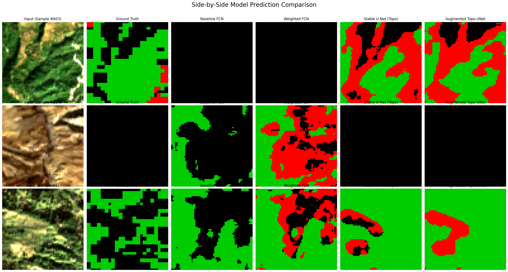

# Geospatial Deep Learning for Deforestation Mapping in Nepal

### A Comparative Analysis of Deep Learning Techniques for Semantic Segmentation of Satellite Imagery

---

## Project Overview

This project implements and evaluates an end-to-end deep learning pipeline for mapping forest cover and deforestation in Nepal. Using Google Earth Engine for data acquisition and PyTorch for model development, the project undertakes a rigorous, multi-stage comparative analysis to tackle the core challenges of semantic segmentation on satellite data: **severe class imbalance** and **training instability**.

The central hypothesis is that a sophisticated model, trained with advanced techniques on multi-modal satellite data, can learn to identify historical deforestation from a single, recent satellite image, providing a powerful workflow for environmental monitoring.

- **Data Sources:** Sentinel-2 (4-band spectral) & SRTM (2-band topographic)
- **Ground Truth:** Hansen Global Forest Change Dataset (3 classes: Forest, Non-Forest, Deforested)
- **Primary Frameworks:** PyTorch, Google Earth Engine API, Albumentations

---

## The Methodological Journey: A Four-Model Comparison

This project tells a story of iterative improvement, where each model is designed to solve a weakness diagnosed in the previous one.

1.  **Baseline FCN:** A simple Fully Convolutional Network that establishes a performance baseline and reveals the critical impact of class imbalance.
2.  **Weighted FCN:** The FCN retrained with a `WeightedCrossEntropyLoss` to specifically address the model's failure to learn the rare "Deforested" class.
3.  **Stable U-Net (Topo):** A superior U-Net architecture trained on enriched, 6-channel data (spectral + topographic) and stabilized with a learning rate scheduler.
4.  **Augmented Topo-UNet (Winner):** The final model, incorporating geometric data augmentation to improve generalization and robustness.

---

## Key Results

The final analysis demonstrates that the **Augmented Topo-UNet** is the most effective and well-balanced model. The iterative enhancements successfully addressed the core challenges, with the final model achieving a **Mean IoU of 0.471** and a **Macro F1-Score of 0.557**.

| Metric | Baseline FCN | Weighted FCN | Stable U-Net | **Augmented U-Net ** |
|:---|:---:|:---:|:---:|:---:|
| **Mean IoU (mIoU)** | 0.501 | 0.433 | 0.478 | **0.471** |
| **Macro F1-Score**| 0.571 | 0.529 | 0.562 | **0.557** |
| **Recall (Deforested)** | 0.000 | 0.542 | 0.497 | **0.543** |
| **Precision (Deforested)**| 0.000 | 0.009 | **0.013** | 0.012 |

*(Note: The table reflects the final, corrected results from the full experimental run.)*

---

## Visual Analysis of Model Progression

The side-by-side comparison below perfectly illustrates the project's story. The Baseline FCN ignores deforestation (red). The Weighted FCN learns to see it, but its predictions are noisy. The U-Net models produce the cleanest, most spatially coherent maps, demonstrating their superior architecture.

*(Suggestion: Place your final visualization image in a `figures` subfolder in your GitHub repository for clean organization.)*

---

## How to Run

The entire workflow is contained within the `Nepal_deforestation_analysis.ipynb` Jupyter Notebook. The notebook is structured as a report, with master functions for training and evaluation defined upfront, followed by a series of modular experimental cells.

### Requirements:
1.  A Google account with **Google Earth Engine access**.
2.  A Google Colab environment with a **`GCP_PROJECT_ID` secret** containing a valid GEE-linked project ID.
3.  Required Python libraries are installed at the beginning of the notebook.

### Workflow Steps:
1.  **Setup & Definitions:** All master functions, classes, and imports are defined.
2.  **Foundational Analysis:** GEE is used to perform a preliminary analysis of forest change.
3.  **Data Preparation:** Scripts to export the static and topographic datasets from GEE. *(This is a time-intensive, one-time setup.)*
4.  **Model Training & Experiments:** A series of modular `Train -> Analyze` cells for each of the four experiments. Each run is fully checkpointed.
5.  **Final Analysis:** The final section loads all saved models and dynamically generates the comparison table and visualizations.

---

## Conclusion & Future Work

### Conclusion
This project successfully developed an end-to-end pipeline and demonstrated that a **U-Net architecture, enhanced with topographic data and trained with a weighted loss and data augmentation, is the most effective approach** for this challenging segmentation task. A key finding is that while these techniques dramatically improve the model's ability to **detect** deforestation (Recall), achieving high **Precision** remains a fundamental challenge for single-snapshot models due to spectral ambiguity.

### Future Work
To solve the remaining precision problem, future work should focus on providing the model with explicit temporal context:

-   **Temporal Change Detection:** Reframe the problem by providing the model with two images from different time periods (`t1` and `t2`) as a single, multi-channel input. This would allow the model to learn the direct signature of *change*, which is a much more powerful signal for deforestation than a static state.
-   **Advanced Architectures (e.g., Vision Transformer):** A Transformer-based architecture like **SegFormer** could be implemented on this temporal data. Its self-attention mechanism is ideally suited to learn the global context needed to distinguish a long, winding river from a small, isolated deforestation patch.